  

## 🧪 Evaluation report

| Criterion | Verdict | Evidence |
|:--|:--:|:--|
| Builds things that actually run | ✅ | <!-- COUNT:START -->10<!-- COUNT:END --> public projects, <!-- LIVE:START -->6<!-- LIVE:END --> deployed live |
| Doesn't trust model output blindly | ✅ | Schema validation and prompt-injection guards in every AI app |
| Tests before shipping | ✅ | pytest + GitHub Actions on the AI projects |
| Knows when an AI judge is biased | ✅ | Position-bias check in `llm-response-evaluator` |
| Measures data quality, not vibes | ✅ | Cohen's kappa in `labellint` |
| Currently leveling up | 🔄 | FastAPI · JWT auth · API-first design |

## ⚡ Projects

## 🧰 Toolbox

  

## 🐍 Activity

<picture>
  <source media="(prefers-color-scheme: dark)" srcset="https://raw.githubusercontent.com/ivanedens55-web/ivanedens55-web/output/github-snake-dark.svg" />
  <source media="(prefers-color-scheme: light)" srcset="https://raw.githubusercontent.com/ivanedens55-web/ivanedens55-web/output/github-snake.svg" />
  
</picture>

## 📡 Reach me

[WhatsApp](https://wa.me/254111341897) · [LinkedIn](https://linkedin.com/in/ivan-Kipkoech) · [Email](mailto:ivanedens55@gmail.com)

